# Client-Teste-VR

## Passos para Rodar a Aplicação

1. **Clone o Repositório**

   Primeiramente, clone o repositório utilizando um dos métodos abaixo:


**Método SSH:**

   ```bash
   git clone git@github.com:WesleySCorrea/client-teste-vr.git
   ```

**Método HTTPS:**

   ```bash
   git clone https://github.com/WesleySCorrea/client-teste-vr.git
   ```

1. **Interface- Java Swing**

Ao iniciar a interface do Java Swing, iniciaremos com uma simples tela de login, onde para acessar os demais conteudos, deve-se utilizar username e password **admin**.

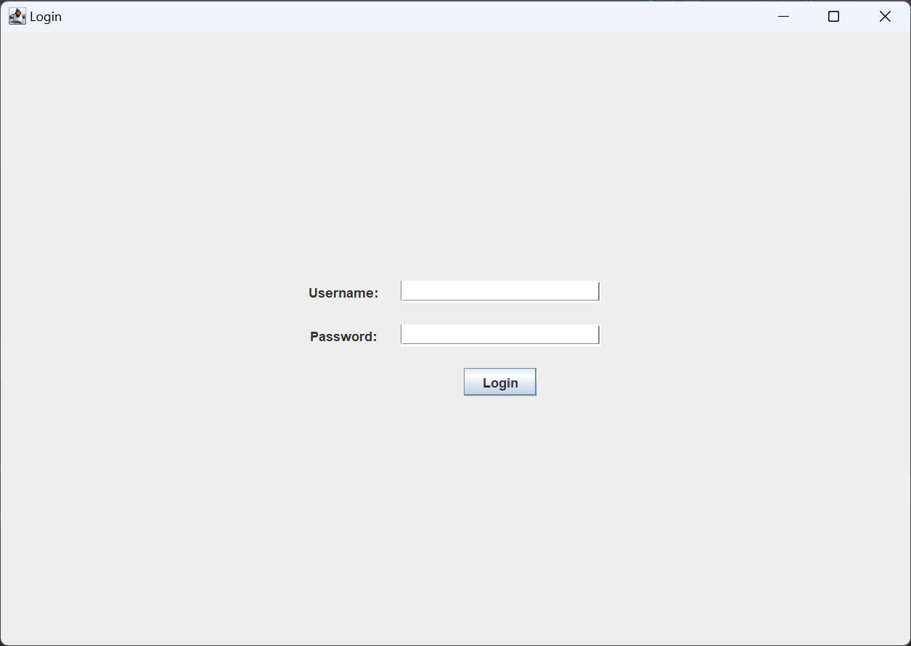

Com login bem sucedido, entramos na página home, e ao lado esquerdo da tela, temos o menu com as informaçoes de **Clientes, Produtos e Pedidos**.

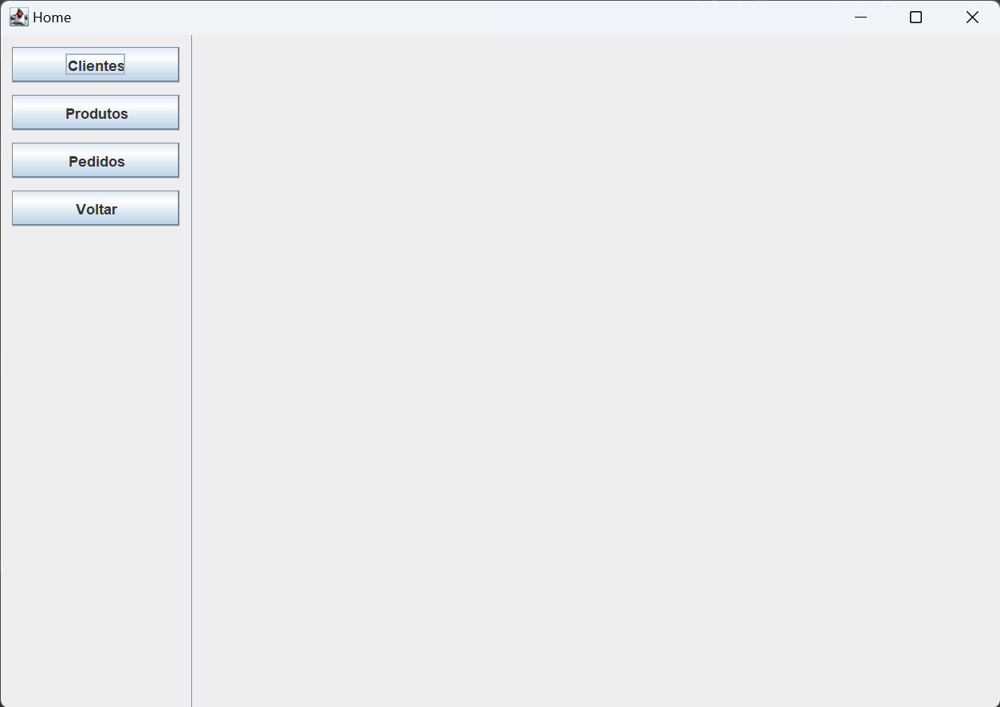

Ao selecinar o menu pretendido, abrimos uma segunda coluna de botões onde abriremos mais opções sobre o mesmo.

Por exemplo, clicando no botão **Clientes**, teremos mais quatro opões sobre clientes, que são:

 - Cadastrar Clientes
 - Atualizar Clientes
 - Excluir Clientes
 - Listar Clientes

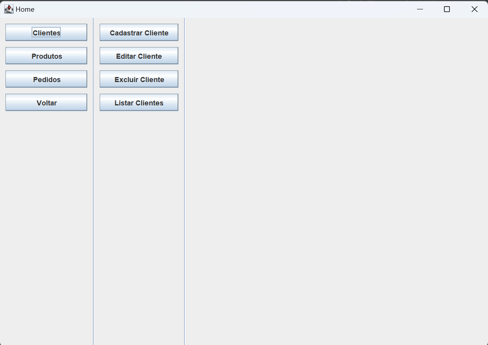

Esse processo se repete para produtos e pedidos, como nas imagens abaixo:

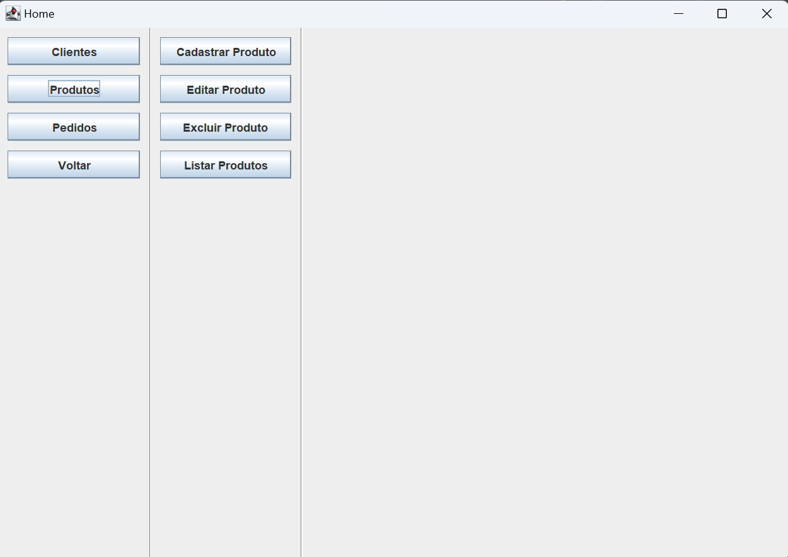 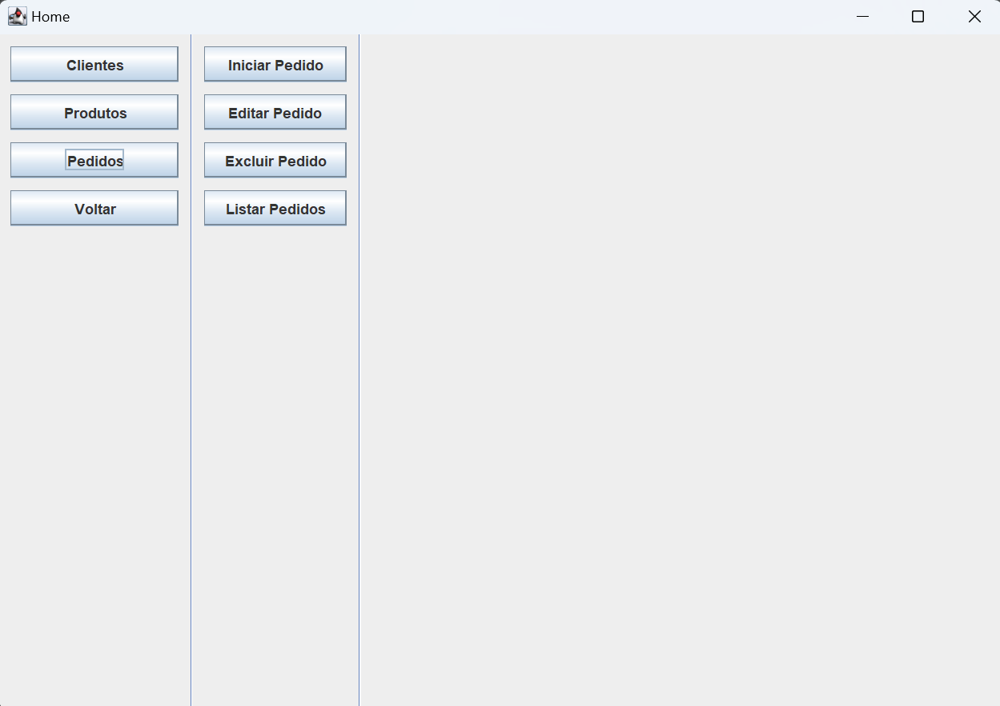

Para realizar o cadastro de um novo cliente, basta preencher os campos e enviar, lembrando que, o dia de vencimento deve-se estar entre 1 e 31, caso o contrário você receberá um aviso e precisará definir um novo valor.

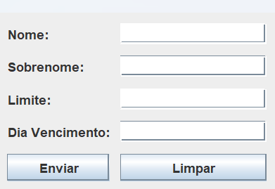  Esse seria um erro, por exemplo.        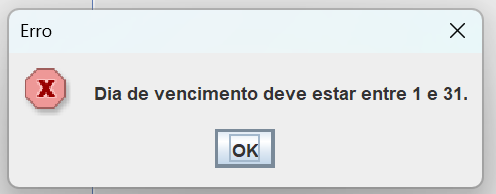

As delas de Atualização e Deleção de clientes são parecidas, você pode buscar o cliente pelo número do ID e após isso, fazer o Update, ou Deleção do **Cliente**
 
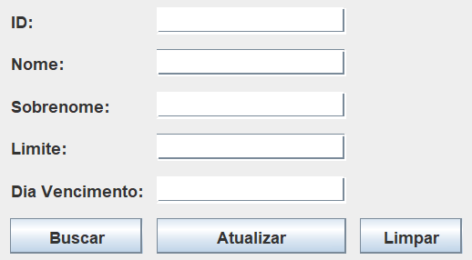    Atualização e Deleção do Mesmo      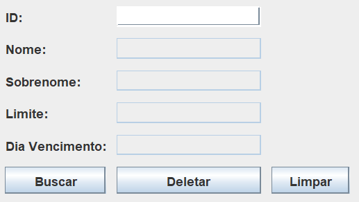

O último botão, será responsável por buscar todos os **Clientes Ativos** que estão no banco de dados.

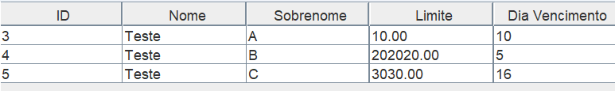

Essas mesmas funções estarão disponiveis na aba de **Produtos**

Para inicialização de um Pedido, basta passa no campo disponível, o **ID do Cliente** em que esse **Pedido** será vinculado.
Após a iniciar o pedido, estatá na tela disponivel informaçoes do **Cliente** e informaçoes do **Pedido**, e logo a baixo aparecera as opções de adicionar os produtos ao pedido.

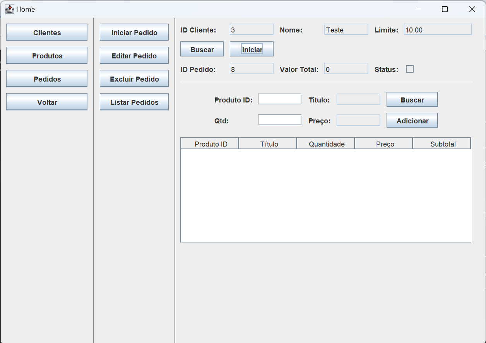

Para adicionar produtos ao pedido, basta informar o **ID do Produto** e a **Quantidade** do mesmo, e apertar o botão de **ADICIONAR**.

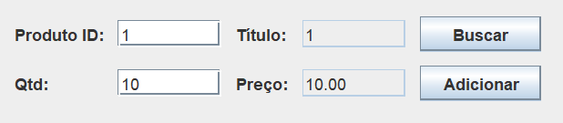

Conforme você adicionar os produtos ao pedido, eles serão acrescentados a lista logo abaixo, a atualizará o valor total do pedido no cabeçalho acima.

Além disso, abrirá a opção de você poder finalizar o pedido, que seria a **CONFIRMAÇÃO** do pedido, fazendo a atualização do saldo do **Cliente** no cabeçalho de informaçoes.

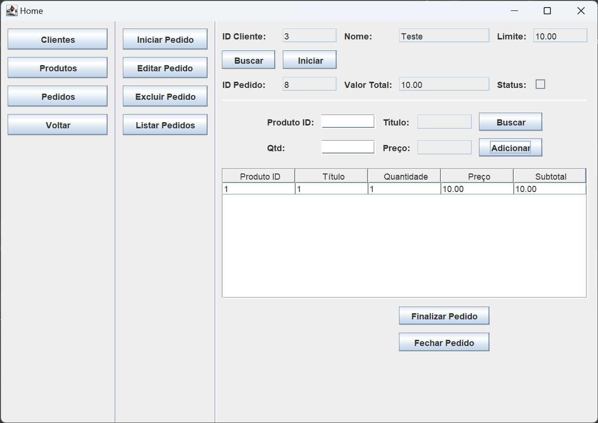

O botão de fechar pedido, apenas da a liberdade de fechar essa janela para que possa realizar outro pedido, porem, se o pedido ainda nao foi finalizado, você conseguirá atualizar o mesmo pelo botão de **ATUALIZAR PEDIDO**

Lembrando que para você atualizar o pedido, ou até mesmo excluir o mesmo, esse pedido nao pode está finalizado.

E por ultimo, o botão de **LISTAR PEDIDOS**, nada mais é do que a listagem paginada de todos os pedidos, independente se estão fechados ou não.

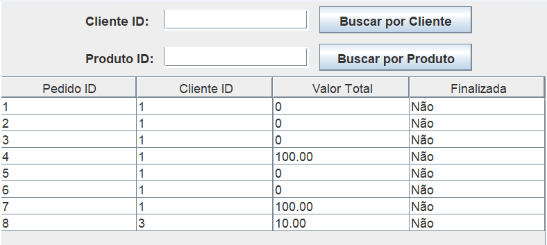

Nessa tela, tem dois campos acima, **Cliente ID** e **Product ID**, eles fazem uma busca na lista, ou pelo **Cliente** ou pelo **Produto**, trazendo todos os pedidos que contenham esses **CLIENTES** ou **PRODUTOS**.

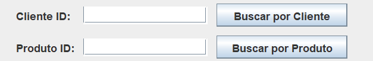"