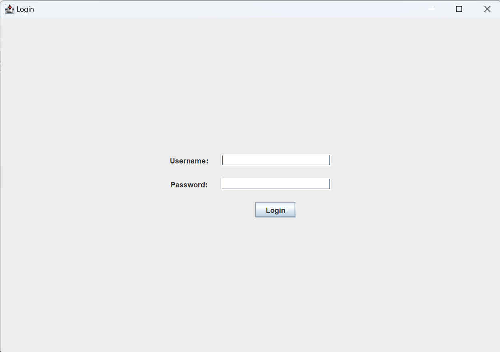

# Client-Teste-VR

## Passos para Rodar a Aplicação

1. **Clone o Repositório**

   Primeiramente, clone o repositório utilizando um dos métodos abaixo:


**Método SSH:**

   ```bash
   git clone git@github.com:WesleySCorrea/client-teste-vr.git
   ```

**Método HTTPS:**

   ```bash
   git clone https://github.com/WesleySCorrea/client-teste-vr.git
   ```

1. **Clone o Repositório**

